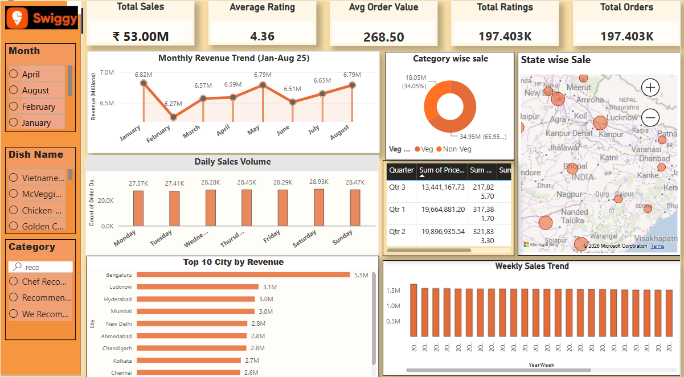
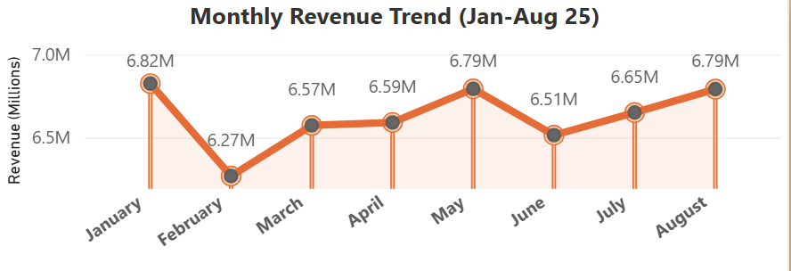
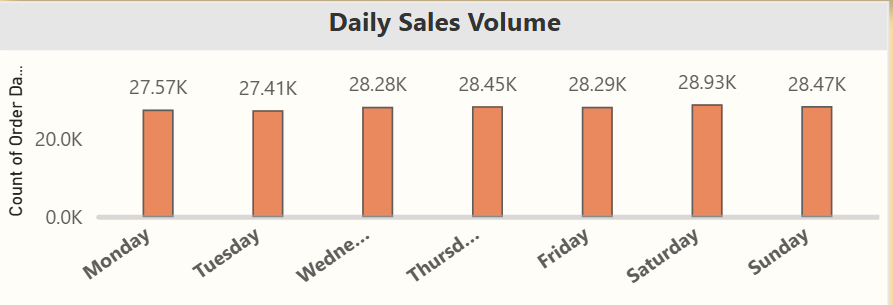
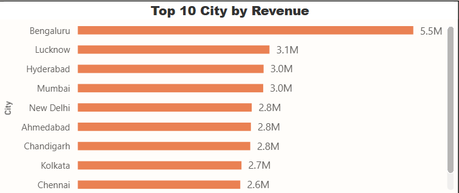
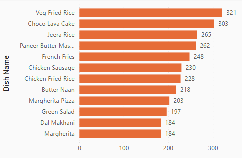
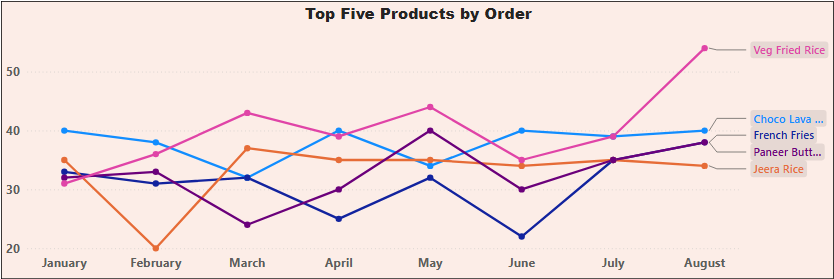
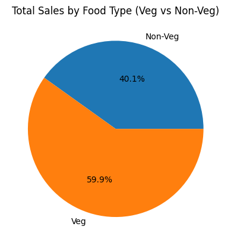
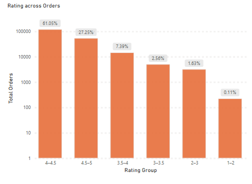

# **Swiggy Sales Performance Analysis**
January – August 2025
## Project Overview 
This project analyzes the swiggy food delivery dataset (7 columns) to identify business insights.This repository contains order-level sales performance data and analytical documentation for platform operations covering January 1, 2025, through August 31, 2025. Across 197,403 total orders, the platform generated ₹53.01M in gross revenue with a stable Average Order Value (AOV) of ₹268.51 and strong customer satisfaction (4.34/5 average rating).

The dataset reflects amature, steady-state business model. The analytical focus centers on geographic revenue concentration, daily order trends, and menu performance optimization.

**Objective:** To Build 5 KPI's and visualize trends for decision-making.

## **Data Limitations**
Geographic Mapping: Each state includes only one city. State-level and city-level data are identical and cannot be analyzed independently.

**Category Labeling:** The category column contains unstandardized free-text entered by merchants (e.g., "Recommended", "Chef's Special"). It measures menu placement performance rather than precise cuisine types.

**Financial Scope:** Figures represent Gross Order Value (GOV) in INR. Margin, delivery fee, marketing discount, and profit data are not included.

## **Field Definitions**
order_date: Transaction times

geography: City and State location (1:1 mapping in this dataset)

restaurant: Restaurant name

category: Merchant-defined menu category

dish_name: Specific food item ordered

price: Gross item price in INR (₹)

rating: Item/restaurant rating score (1.00–5.00)

rating_count: Volume of customer ratings received

## **Key KPI's**
1. **Total Revenue:**   ₹ 53.01M
2. **Total Orders:**  197,403
3. **AVG Order Value:**  ₹ 268.51
4. **AVG Rating:**  4.34/5
5. **Citites Covered:**   28

## **Performance Summary**
1. **Quarterly & Monthly Revenue Dynamics**

Monthly revenue remains stable between ₹6.27M and ₹6.83M, varying by less than 5% from the monthly average. February represents the lowest revenue month, while January and May were peak performers.

|Quarter  | Revenue(INR)| Orders  | Months Covered|
| --------| --------    | --------| --------      |
| Q1 2025 | 19664881.2  | 73085   |3 (Jan–Mar)   |
| Q2 2025 | 19896935.54 | 74155   |3 (Apr–Jun)    |
| Q3 2025 | 13441167.73 | 50163   |2 (Jul–Aug only)|
              
   Note on Q3 Data: Q3 contains only July and August data (missing September). It should be excluded from quarter-over-quarter growth trends.

**Daily Demand**

Weekend order volume is modestly higher than week day volume, not dramatically so. Comparing weekend days
such as Saturday and Sunday to the average of week days from Monday–Friday average of 28,000 orders/day.

Saturday and sunday order was 28933 and 28470 respectively. which is 3.2% and 1.7% more then of week day average. Tuesday order was 2.1% below the average. This is a modest effect, slightly weekend promotion is useful inspitr of  building a compaign.

**Geographic Performance**

Every state have only one city mentioned, so city wise and state wise performance show the same values.
Revenue is heavily concentrated in top cities. Bengaluru is the top performer which alone generate more revenue than the other cities combined. which is 10.2% and the other two cities Lucknow and Hyderabad revenue are 5.2% and 5.2%. The top 5 city generate more than 32% of the total revenue while the other 23 cities combinedly generate 67% of the total revenue each contribute 3.7% to 1.1%. some citities have very lower revenue like Kohima and Aizawl are the smallest under 850K. this might be because of the lower income or lower population in the city.

 

|City         | Revenue (₹) | Orders  | % of Total     |
| --------    | --------    | --------| -----------------  |
| Bengaluru   | 5455887.73  | 20,072   |10.2%              |
| Lucknow     | 3117359.65  | 10,192   |5.2%               |
| Hyderabad   | 3021711.62  | 10,309   |5.2%               |
| Mumbai      | 3015573.35  | 10,507   |5.3%               |
| New Delhi   | 2829180.6   | 10,191   |5.2%               |

## **Product And Category Performance**

**Top Selling Dishes**

Swiggy Platform dataset have a very large catalog having 56588  distinct dishes. no single dishe dominate, even the top performer represent 0.15% of total orders. choco lava cake dominat the stable sale month on month basis, veg fried rice sales are fluctuating month to months.
here we can see the Top 5 Dishes by revenue and by order count.

**Top Performance in Category**

Recommended is the largest single category at 13.6% of total revenue share. its revenue are ₹7.19M, Awith verage order value ₹298. it has  generated more revenue then any other category. The next large category is "Main Course" generated 1.5% revenue. Actually these are not food types but Menue Placement Label. We can also see the revenue in terms of Veg vs non-veg. Non-veg generate around 60% of the revenue.

| Category	| Revenue(₹) | Orders| AOV(₹) | % of Total|
|-----------|------------|-------|------- | ----------|
|Recommended|7188273     |24098  |	298	  |12.2%      |
|Main Course|767175      |2983   |	257	  |1.5%       |
|Burgers	|695149      |2539   |	274	  |1.3%       |
|Sweets	    |475068      |1954|	243	      |1.0%       |
|Burger Combos(3 Pc Meals)|507774|1331|	381	|0.7%     |

## **Quality & Ratings**

Overall Rating Quality is strong: 96.5 orders have rating more than 3.5 and the average rating remain stable at 4.3. so this indicate that this business his no quality issues.

## **Recommendations**
* Grow the other cities, deliberately
* Weekend promotions to the real lift, not an inflated one
* Test menu placement as a revenue lever
* Investigate two specific dishes, not a broad quality audit
